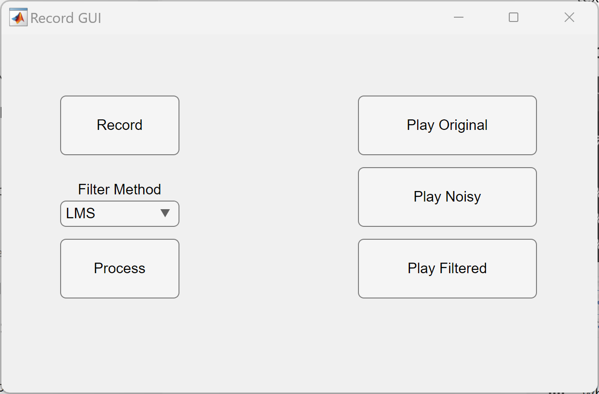
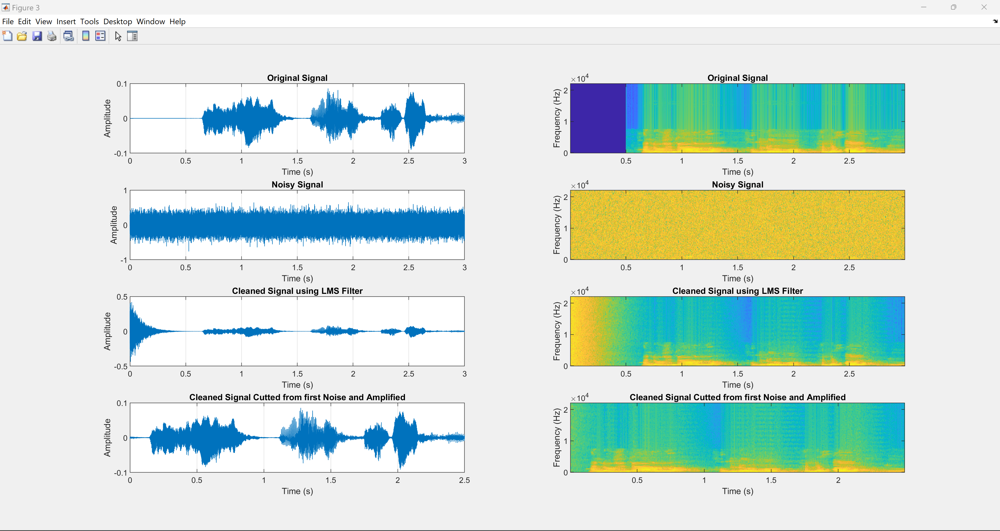

# Adaptive Filter Application

## Description
This program offers a graphical user interface (GUI) for recording audio signals and processing them with adaptive filtering. It records an audio signal, adds noise to create a noisy signal, and then cleans the noisy signal using either an LMS or RLS adaptive filter. The cleaned signal is optionally amplified (for LMS only) and played back. Both the original and filtered signals are saved as audio files. The GUI also displays time-domain plots and spectrograms of the signals.

## Info
Authors
- Marcelo Argotti Gomez
- Juliette Naumann

Date:
July 4, 2024

## Usage

### Requirements
- MATLAB
- Signal Processing Toolbox (for `dsp.LMSFilter` and `dsp.RLSFilter`)

### How to Run
1. Open MATLAB.
2. Navigate to the directory containing the program files.
3. Run the `filterGui_main.m` script to launch the GUI.

### GUI Overview
The GUI contains the following components:
- **Record Button**: Starts recording an audio signal.
- **Filter Method Dropdown**: Allows the user to select the filter type (LMS or RLS).
- **Process Button**: Processes the recorded signal with the selected filter.
- **Play Original Button**: Plays the original recorded audio signal.
- **Play Noisy Button**: Plays the noisy version of the recorded audio signal.
- **Play Filtered Button**: Plays the cleaned and amplified version of the recorded audio signal (for LMS) or the cleaned version (for RLS).
- **Label**: Displays messages indicating the current operation being performed.

  

### Steps to Use the Program
1. **Start the GUI**: Run the `filterGui_main.m` script.
2. **Record an Audio Signal**:
   - Click the "Record" button.
   - The GUI will display a message indicating that recording is in progress.
   - The recording will last for a specified duration (default is 3 seconds).
3. **Process the Recorded Signal**:
   - Select the filter method (LMS or RLS) using the dropdown menu labeled "Filter Method".
   - Click the "Process" button to process the signal with the selected filter.
   - Messages will be displayed in the GUI during each step of the processing.
4. **Play Processed Signals**:
   - Use the "Play Original" button to hear the original recorded signal.
   - Use the "Play Noisy" button to hear the noisy signal.
   - Use the "Play Filtered" button to hear the filtered signal.
   - The label will display messages indicating which signal is being played.

### Signal Visualization
The program visualizes the signals in two ways: 
1. Time-domain plots display the original signal, the noisy signal, and the cleaned signal. The signal is filtered using either an LMS or RLS filter. For LMS filtering, the cleaned signal is also amplified. Additionally, the initial pulse during the filter's attack phase is removed in the final processing steps.
2. Spectrograms displaying the frequency content of the signals over time.

  

### Functions

#### filterGui_main
- **Description**: Main script for creating and displaying the GUI. Handles user interactions through buttons to record and play various signals.
- **Usage**: Run the script to open the GUI. Use the buttons to record and play signals.

#### recorder
- **Description**: Function to record an audio signal for a specified duration. Stores the recorded audio and sampling frequency for further processing.
- **Inputs**: 
  - `fig`: The GUI figure handle to display messages.
- **Outputs**:
  - `recorded_audio`: The recorded audio signal.
  - `fs`: The sampling frequency of the recorded audio.
  - `rec_sec`: The duration of the recording in seconds.
- **Usage**: `[recorded_audio, fs, rec_sec] = recorder(fig);`

#### adaptFilter
- **Description**: Function to apply adaptive filtering to a recorded audio signal. Generates a noisy signal, cleans it using LMS or RLS adaptive filtering, and amplifies the cleaned signal if LMS is used. Plots the original, noisy, cleaned, and amplified signals, and saves the filtered signal to a file.
- **Inputs**: 
  - `recorded_audio`: The recorded audio signal.
  - `fs`: The sampling frequency of the recorded audio.
  - `fig`: The GUI figure handle to display messages.
  - `filter_type`: The type of adaptive filter to use ('LMS' or 'RLS').
- **Outputs**:
  - `recorded_audio`: The recorded audio signal (unchanged).
  - `noisy_signal`: The generated noisy signal.
  - `cleaned_signal`: The cleaned signal after filtering.
  - `amplifiedAudio`: The amplified cleaned signal (only for LMS).
  - `fs`: The sampling frequency of the signals.
- **Usage**: `[recorded_audio, noisy_signal, cleaned_signal, amplifiedAudio, fs] = adaptFilter(recorded_audio, fs, fig, filter_type);`

#### getRLS
- **Description**: Implements the RLS adaptive filter.
- **Inputs**: 
  - `d`: The vector of desired signal samples (reference signal).
  - `x`: The vector of input signal samples.
  - `lamda`: The weight parameter (forgetting factor).
  - `M`: The number of taps (filter order).
- **Outputs**:
  - `e`: The output error vector.
  - `y`: The output coefficients.
  - `w`: The filter parameters.
- **Usage**: `[e, y, w] = getRLS(d, x, lamda, M);`

## Notes
- Ensure that your sound system is turned on to hear the playback of the recorded and processed signals.
- Make sure the microphone is turned on to record the audio signal.
- The amplified cleaned signal is saved as `FilteredSignal_LMS.wav` or `FilteredSignal_RLS.wav` in the working directory.
